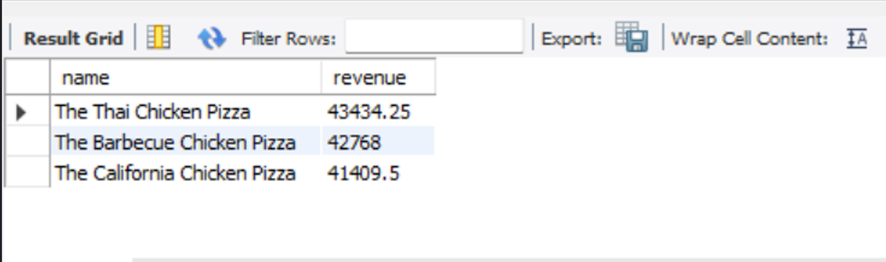
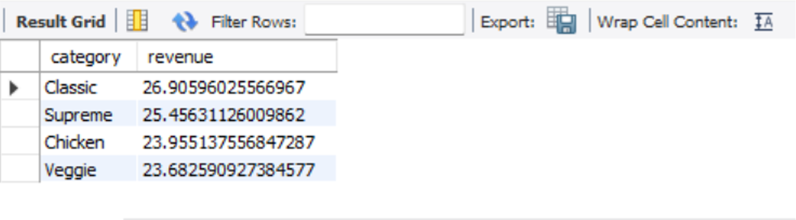

# 🍕 Pizza Sales Analysis Project

## 📌 Project Overview
This project analyzes pizza sales data using SQL to find business insights such as total revenue, best-selling pizzas, and customer ordering patterns.

---

## 🎯 Problem Statement
To analyze pizza sales data and extract meaningful insights that help in understanding customer behavior and business performance.

---

## 🛠 Tools Used
- SQL (MySQL)
- VS Code
- Git & GitHub

---

## 📂 Dataset Information
The dataset contains:
- Orders data
- Order_details
- Pizza_types
- Pizzas 

---

## 📊 Key Analysis Performed

- Total number of orders
- Total revenue generated
- Most expensive pizza
- Most ordered pizza size
- Top 5 best-selling pizzas
- Category-wise sales
- Hourly order distribution
- Daily revenue trend
- Cumulative revenue analysis
- Revenue contribution by category

---

## 📸 SQL Query Results

### 🔹 Total Revenue

### 🔹 Top Selling Pizzas

### 3. Category-wise Sales

### 4. Top 3 orderd pizzas based on revenue each category
(images/Top_3ordered_by_revenue_category.png)

### 5. Cumaltive sum
(images/cumaltive_sum.png)

---

## 📁 Project Structure

pizza-sales-analysis/
│
├── sql/
│ └── pizza_sales_queries.sql
│
├── images/
│ └── screenshots.png
│
├── README.md

---

## 🚀 How to Run This Project
1. Import dataset into MySQL
2. Run SQL queries from `sql/` folder
3. View results in MySQL Workbench
4. Analyze insights

---

## 📌 Key Insights
- Most ordered pizza category: Classic
- Highest revenue pizza: The Thai Chicken Pizza
- Peak order time: Evening

---

## 👨‍💻 Author
Deepak Rao  
(Data Analyst)